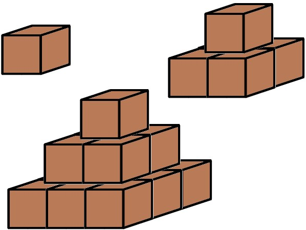

# Exercice 4

Les habitants de « pyramidesville » adorent les constructions en forme de pyramide ; de nombreux bâtiments officiels ont d'ailleurs cette forme. Pour fêter les 150 ans de la construction de la ville, le gouverneur a demandé la construction d'une grande et majestueuse pyramide à l'entrée de la ville. Malheureusement, en ces périodes de rigueur budgétaire, il y a peu d'argent pour ce projet. Les architectes souhaitent cependant construire la plus grande pyramide possible étant donné le budget prévu.

Votre programme doit d'abord lire un entier : le nombre maximum de pierres dont pourra être composée la pyramide. Il devra ensuite calculer et afficher un entier : la hauteur de la plus grande pyramide qui pourra être construite, ainsi que le nombre de pierres qui sera nécessaire.

